# iOS Orb

[](https://dl.circleci.com/status-badge/redirect/gh/kevnm67/ios-orb/tree/main)
[![CircleCI Orb Version][orb_badge]][orb_registry]
[](https://qlty.sh/gh/kevnm67/projects/ios-orb)
[](https://qlty.sh/gh/kevnm67/projects/ios-orb)

A CircleCI orb for iOS CI/CD pipelines — reusable commands, jobs,
and executors for building, testing, and deploying iOS/macOS apps.

**📦 [kevnm67/ios-orb on the CircleCI Orb Registry][orb_registry]**

---

## Table of Contents

- [Quick Start](#quick-start)
- [Architecture](#architecture)
- [Executor](#executor)
- [Commands](#commands)
    - [setup](#setup)
    - [lane](#lane)
    - [xcodegen](#xcodegen)
    - [tuist\_generate](#tuist_generate)
    - [install\_tools](#install_tools)
    - [swiftlint](#swiftlint)
    - [swiftformat](#swiftformat)
    - [periphery\_scan](#periphery_scan)
    - [match\_signing](#match_signing)
    - [build\_xcode / test\_xcode](#build_xcode--test_xcode)
    - [build\_spm / test\_spm](#build_spm--test_spm)
    - [create\_release\_tag](#create_release_tag)
    - [brew\_install](#brew_install)
    - [restore\_brew](#restore_brew)
    - [cache\_spm / restore\_spm\_cache](#cache_spm--restore_spm_cache)
    - [cache\_derived\_data / restore\_derived\_data](#cache_derived_data--restore_derived_data)
    - [resolve\_test\_splits](#resolve_test_splits)
    - [save\_build\_artifacts](#save_build_artifacts)
    - [test\_with\_qlty](#test_with_qlty)
    - [upload\_qlty\_coverage](#upload_qlty_coverage)
    - [export\_coverage](#export_coverage)
    - [preboot\_simulator](#preboot_simulator)
    - [assert\_xcode\_channel](#assert_xcode_channel)
    - [upload\_dsyms](#upload_dsyms)
    - [notarize\_macos](#notarize_macos)
    - [deploy\_testflight](#deploy_testflight)
    - [notify\_slack](#notify_slack)
- [Jobs](#jobs)
    - [run\_with\_setup](#run_with_setup)
    - [test](#test)
    - [build\_and\_test\_xcode](#build_and_test_xcode)
    - [build\_and\_test\_spm](#build_and_test_spm)
- [Environment Variables](#environment-variables)
- [Workflow Examples](#workflow-examples)
- [Orb Dependencies](#orb-dependencies)
- [Resources](#resources)
- [Contributing](#contributing)
- [Publishing](#publishing)

---

## Quick Start

```yaml
version: 2.1

orbs:
    ios: kevnm67/ios-orb@3.2.0

workflows:
    build-test:
        jobs:
            - ios/run_with_setup:
                name: test
                scripts:
                    - run: bundle exec fastlane test
```

---

## Architecture



---

## Executor

### `macos`

Apple Silicon macOS executor with Xcode and Homebrew pre-configured. The
default image is Xcode 26.6 (Swift 6.3, iOS 26.5 simulators, macOS 26.5);
see CircleCI's [supported Xcode versions](https://circleci.com/docs/guides/execution-managed/using-macos/#supported-xcode-versions-silicon).

| Parameter | Type | Default | Description |
|-----------|------|---------|-------------|
| `xcode_version` | string | `26.6` | Xcode version (CircleCI image tag, e.g. `26.6`, `26.5`, `27.0` beta) |
| `resource_class` | string | `m4pro.medium` | macOS resource class (`m4pro.medium` or `m4pro.large`) |

Sets `HOMEBREW_NO_AUTO_UPDATE=1` and `HOMEBREW_NO_INSTALL_CLEANUP=1`.

---

## Commands

### `setup`

Initialize build environment: checkout, workspace, Ruby/Bundler, SPM cache.

```yaml
steps:
    - ios/setup:
        checkout: true
        bundle_install: true
        persist_workspace: true
```

| Parameter | Type | Default | Description |
|-----------|------|---------|-------------|
| `attach_workspace` | boolean | `false` | Whether to attach to an existing workspace |
| `checkout` | boolean | `false` | Whether to checkout as a first step |
| `bundle_install` | boolean | `true` | Whether to run `bundle install` |
| `ruby_version` | string | `3.3` | Ruby version to install |
| `key` | string | `gems-v2` | Cache key for Ruby gems (immutable) |
| `persist_workspace` | boolean | `true` | Whether the job should persist files to a workspace |
| `scripts` | steps | `[]` | Scripts to run between attaching and saving the workspace (installing dependencies) |
| `xcode_project` | string | `""` | Name of your xcodeproj for setting the path to the `Package.resolved` file |
| `with_spm` | boolean | `false` | Setup environment for installing SPM packages (works around xcbuild SSH errors) |
| `workspace_root` | string | `.` | Absolute path, or a path relative to `working_directory` |

### `lane`

Run a Fastlane lane.

```yaml
steps:
    - ios/lane:
        named: test
```

| Parameter | Type | Default | Description |
|-----------|------|---------|-------------|
| `named` | string | — | Lane to run |

### `xcodegen`

Install XcodeGen and generate the Xcode project.

```yaml
steps:
    - ios/xcodegen:
        spec: project.yml
        quiet: true
```

| Parameter | Type | Default | Description |
|-----------|------|---------|-------------|
| `spec` | string | `project.yml` | Path to the XcodeGen spec file |
| `quiet` | boolean | `true` | Whether to suppress XcodeGen output |

### `tuist_generate`

Install Tuist (Homebrew cask) and generate the Xcode workspace with
`--no-open`, so CI never tries to launch Xcode.

```yaml
steps:
    - ios/tuist_generate:
        path: ''
```

| Parameter | Type | Default | Description |
|-----------|------|---------|-------------|
| `path` | string | `""` | Path to the directory or subdirectory of the Tuist project. Leave empty to use the current directory |

### `install_tools`

Install Homebrew tools (only if missing).

```yaml
steps:
    - ios/install_tools:
        tools: xcodegen swiftlint xcresultparser
```

| Parameter | Type | Default | Description |
|-----------|------|---------|-------------|
| `tools` | string | `xcodegen swiftlint` | Space-separated list of Homebrew formulas to install |

### `swiftlint`

Run SwiftLint with optional strict mode.

```yaml
steps:
    - ios/swiftlint:
        strict: true
```

| Parameter | Type | Default | Description |
|-----------|------|---------|-------------|
| `strict` | boolean | `false` | Whether to use strict mode (warnings become errors) |
| `config` | string | `""` | Path to SwiftLint configuration file |
| `reporter` | string | `""` | Reporter type (`xcode`, `json`, `csv`, `emoji`, etc.) |

### `swiftformat`

Run SwiftFormat in check-only lint mode by default. Installs via Homebrew if
not already available. No-Fastfile path — Fastlane users can keep it in a
lane instead.

```yaml
steps:
    - ios/swiftformat:
        lint: true
        paths: Sources Tests
```

| Parameter | Type | Default | Description |
|-----------|------|---------|-------------|
| `lint` | boolean | `true` | Whether to run in check-only mode (`--lint`, fails on unformatted files without changing them). Set to `false` to format in place |
| `config` | string | `""` | Path to a SwiftFormat configuration file |
| `paths` | string | `.` | Space-separated paths to format or lint |

### `periphery_scan`

Scan for unused Swift code with Periphery. Installs via Homebrew if not
already available. No-Fastfile path — Fastlane users can keep it in a lane
instead.

```yaml
steps:
    - ios/periphery_scan:
        config: .periphery.yml
        strict: true
```

| Parameter | Type | Default | Description |
|-----------|------|---------|-------------|
| `config` | string | `""` | Path to a Periphery configuration file |
| `strict` | boolean | `false` | Whether to fail the scan on any result (`--strict`) |
| `extra_args` | string | `""` | Additional space-separated flags to pass to `periphery scan` |

### `match_signing`

Sync code signing via Fastlane match. Supports multiple types in a single step.

```yaml
steps:
    - ios/match_signing:
        type: "adhoc,appstore"
        readonly: false
```

| Parameter | Type | Default | Description |
|-----------|------|---------|-------------|
| `type` | string | `appstore` | Comma-separated match types: development, adhoc, appstore, enterprise |
| `readonly` | boolean | `false` | Run match in read-only mode |
| `app_identifier` | string | `""` | Bundle ID (inferred from Matchfile or `MATCH_APP_IDENTIFIER` if empty) |

### `build_xcode` / `test_xcode`

Fallback for projects **without a Fastfile**: build and test with raw
`xcodebuild`, piped through `xcbeautify`. `test_xcode` enables code coverage,
writes the xcresult bundle and stores a JUnit report for CircleCI Test
Insights. Fastlane projects should use [`lane`](#lane) / the [`test`](#test)
job instead — `scan` produces the xcresult and JUnit output natively.
`test_xcode` automatically narrows to `-only-testing:` flags when
[`resolve_test_splits`](#resolve_test_splits) has exported `TEST_SPLITS_FILE`
earlier in the job (wired automatically by `build_and_test_xcode`'s
`split_tests` parameter).

```yaml
steps:
    - ios/build_xcode:
        scheme: MyApp
        destination: "platform=iOS Simulator,name=iPhone 17"
    - ios/test_xcode:
        scheme: MyApp
        destination: "platform=iOS Simulator,name=iPhone 17"
        result_bundle_path: TestResults.xcresult
```

**`build_xcode` parameters**

| Parameter | Type | Default | Description |
|-----------|------|---------|-------------|
| `scheme` | string | — | The Xcode scheme to build |
| `project` | string | `""` | Path to the `.xcodeproj` file (empty = default project in the directory) |
| `destination` | string | `platform=macOS` | Build destination (e.g. `platform=macOS` or `platform=iOS Simulator,name=iPhone 17`) |
| `configuration` | string | `Debug` | Build configuration (Debug or Release) |

**`test_xcode` parameters**

| Parameter | Type | Default | Description |
|-----------|------|---------|-------------|
| `scheme` | string | — | The Xcode scheme to test |
| `project` | string | `""` | Path to the `.xcodeproj` file (empty = default project in the directory) |
| `destination` | string | `platform=macOS` | Test destination (e.g. `platform=macOS` or `platform=iOS Simulator,name=iPhone 17`) |
| `result_bundle_path` | string | `TestResults.xcresult` | Path to store the xcresult bundle |
| `junit_report` | string | `test-results.xml` | Path of the JUnit XML report written by xcbeautify and stored as test results |
| `retry_on_failure` | boolean | `false` | Whether to retry only the tests that failed (`xcodebuild -retry-tests-on-failure`) |
| `test_iterations` | integer | `3` | Maximum iterations per test when `retry_on_failure` is enabled (`xcodebuild -test-iterations`) |
| `test_target` | string | `""` | Test target name used to scope `-only-testing` filters when a test-splits file is present on `TEST_SPLITS_FILE` (see [`resolve_test_splits`](#resolve_test_splits)). Leave empty to default to the scheme name |
| `junit_source` | enum | `xcbeautify` | How to produce the JUnit report: `xcbeautify` (default) uses xcbeautify's own JUnit reporter; `xcresultparser` runs plain xcodebuild through xcbeautify (no report) and separately converts the xcresult bundle to JUnit XML with xcresultparser, installing it via Homebrew if missing |

### `build_spm` / `test_spm`

Build and test a Swift package. `test_spm` runs with coverage and `--parallel`
by default and stores a JUnit report from `build/reports`. `test_spm`
automatically adds `--filter` flags per line when
[`resolve_test_splits`](#resolve_test_splits) has exported `TEST_SPLITS_FILE`
earlier in the job (wired automatically by `build_and_test_spm`'s
`split_tests` parameter).

```yaml
steps:
    - ios/build_spm:
        configuration: release
        build_flags: -Xswiftc -warnings-as-errors
    - ios/test_spm:
        filter: MyModuleTests
```

**`build_spm` parameters**

| Parameter | Type | Default | Description |
|-----------|------|---------|-------------|
| `build_flags` | string | `""` | Additional flags to pass to `swift build` |
| `configuration` | string | `debug` | Build configuration (debug or release) |

**`test_spm` parameters**

| Parameter | Type | Default | Description |
|-----------|------|---------|-------------|
| `filter` | string | `""` | Test filter pattern (e.g. `MyModuleTests` or `MyModuleTests/testSpecificCase`) |
| `parallel` | boolean | `true` | Whether to run tests in parallel |
| `coverage` | boolean | `true` | Whether to enable code coverage collection |
| `report_path` | string | `build/reports` | Directory the JUnit report is written to and stored from |
| `test_framework` | enum | `auto` | Which test framework to run: `auto` detects Swift Testing via `import Testing` in `Tests/` (else xctest), or force `xctest` / `swift-testing`. `swift-testing` forces `--parallel` and writes an xunit report via `swift test --xunit-output` |

### `create_release_tag`

Create and push the next `vX.Y.Z` tag — patch-increment of the latest tag
(`git-describe`) or read from the project's `MARKETING_VERSION`.

```yaml
steps:
    - ios/create_release_tag:
        version_source: marketing-version
```

| Parameter | Type | Default | Description |
|-----------|------|---------|-------------|
| `version_source` | string | `git-describe` | How to determine the version number: `git-describe` increments patch from the latest tag, `marketing-version` reads `MARKETING_VERSION` from the Xcode project |

### `brew_install`

Install a Homebrew formula with optional caching.

```yaml
steps:
    - ios/brew_install:
        formula: xcresultparser
```

| Parameter | Type | Default | Description |
|-----------|------|---------|-------------|
| `brew_cache_key` | string | `brew-v1` | Cache key (prefixed). The key is immutable |
| `brew_dir` | string | `/opt/homebrew` | Local homebrew directory |
| `cellar_dir` | string | `/opt/homebrew/Cellar` | Local cellar directory for brew casks |
| `formula` | string | `""` | Homebrew formula to install if needed |
| `reinstall` | boolean | `false` | Whether to reinstall the formula |
| `with_cache` | boolean | `true` | Whether to restore and save cache between brew commands |
| `post_steps` | steps | `[]` | Additional steps to run after brew install |

### `restore_brew`

Tries to restore the local Homebrew cache written by [`brew_install`](#brew_install).

```yaml
steps:
    - ios/restore_brew:
        brew_cache_key: brew-v1
```

| Parameter | Type | Default | Description |
|-----------|------|---------|-------------|
| `brew_cache_key` | string | `brew-v1` | Cache key (prefixed). The key is immutable |

### `cache_spm` / `restore_spm_cache`

Cache and restore Swift Package Manager dependencies. The cache checksum keys
on `<xcode_project>.xcodeproj/project.xcworkspace/xcshareddata/swiftpm/Package.resolved`
when `xcode_project` is set, and falls back to the root `Package.resolved` for
pure SPM packages (leave `xcode_project` empty).

**`cache_spm` parameters**

| Parameter | Type | Default | Description |
|-----------|------|---------|-------------|
| `key` | string | `spm-v1` | Cache key (prefixed). The key is immutable |
| `xcode_project` | string | `""` | Name of your xcodeproj for setting the path to the `Package.resolved` file. Leave empty for pure SPM packages to key on the root `Package.resolved` |
| `path` | string | `.build_output/SourcePackages` | Path where swift packages to be cached are located |

**`restore_spm_cache` parameters**

| Parameter | Type | Default | Description |
|-----------|------|---------|-------------|
| `key` | string | `spm-v1` | Cache key (prefixed). The key is immutable |
| `xcode_project` | string | `""` | Name of your xcodeproj for setting the path to the `Package.resolved` file. Leave empty for pure SPM packages to key on the root `Package.resolved` |

### `cache_derived_data` / `restore_derived_data`

Cache and restore a **best-effort** Xcode DerivedData cache. The checksum
keys on `project.yml` (XcodeGen) when present, falling back to
`<xcode_project>.xcodeproj/project.pbxproj`, and an empty key when neither
exists. This only approximates "did the project structure change" — Xcode's
own incremental-build staleness heuristics still decide whether a cached
build product is actually reusable, so a cache hit is a possible speedup,
not a correctness guarantee.

```yaml
steps:
    - ios/restore_derived_data:
        xcode_project: MyApp
    # ... build_xcode / test_xcode ...
    - ios/cache_derived_data:
        xcode_project: MyApp
```

**`restore_derived_data` / `cache_derived_data` parameters** (identical)

| Parameter | Type | Default | Description |
|-----------|------|---------|-------------|
| `xcode_project` | string | `""` | Name of your xcodeproj (without extension) to key on its `project.pbxproj` when `project.yml` is absent. Leave empty for XcodeGen-only projects |
| `scheme` | string | `""` | Xcode scheme (reserved for a future scheme-scoped cache key; currently unused in the key itself) |
| `key` | string | `dd-v1` | Cache key prefix (immutable) |
| `path` | string | `~/Library/Developer/Xcode/DerivedData` | DerivedData path to restore/save |

### `resolve_test_splits`

Discover test unit names — SPM `Tests/` target subdirectories, or Xcode
`*Tests.swift` class files — and split them across CircleCI parallel test
nodes via `circleci tests split`, writing the assigned slice to
`test-splits.txt` and exporting `TEST_SPLITS_FILE` for `test_xcode` /
`test_spm` to consume automatically. Falls back to the full unit list (with
a warning) when the `circleci` CLI is absent, so local runs still work. Only
useful when the job's `parallelism` parameter is greater than 1 — normally
wired automatically via the `split_tests` parameter on `build_and_test_xcode`
/ `build_and_test_spm` rather than called directly.

```yaml
steps:
    - ios/resolve_test_splits:
        split_kind: xcode
```

| Parameter | Type | Default | Description |
|-----------|------|---------|-------------|
| `split_kind` | enum | — | Which project type to discover test units for: `xcode` or `spm` |
| `test_targets_dir` | string | `Tests` | (spm) Directory whose immediate subdirectories are treated as test target names |
| `test_classes_dir` | string | `.` | (xcode) Directory searched recursively for `*Tests.swift` files |
| `split_by` | string | `name` | Value passed to `circleci tests split --split-by` |

### `save_build_artifacts`

Store build logs, diagnostics, and test results as artifacts.

| Parameter | Type | Default | Description |
|-----------|------|---------|-------------|
| `logs_path` | string | `~/Library/Logs/scan` | Path to build logs |
| `build_logs_path` | string | `~/Library/Logs/DiagnosticReports/` | Path to build logs |
| `test_output_path` | string | `./fastlane/test_output` | Path to test reports |
| `gym_logs_path` | string | `~/Library/Logs/gym` | Path to Fastlane gym (build) logs |

### `test_with_qlty`

Run tests and upload coverage to Qlty Cloud. Successor to the removed
`test_with_code_climate` command.

| Parameter | Type | Default | Description |
|-----------|------|---------|-------------|
| `lane` | string | `""` | Fastlane lane to run |
| `pretest_steps` | steps | `[]` | Steps to run before tests |
| `test_steps` | steps | `[]` | Steps that execute tests (non-Fastlane) |
| `xcode_project` | string | `""` | Project name for SPM cache key |
| `result_bundle_path` | string | `TestResults.xcresult` | Path to xcresult bundle |
| `coverage_file` | string | `coverage.xml` | Exported cobertura XML path |
| `qlty_tag` | string | `""` | Optional Qlty coverage tag (e.g. `unit`, `ui`) |
| `qlty_skip_errors` | boolean | `false` | Make Qlty upload errors non-fatal |

```yaml
steps:
    - ios/test_with_qlty:
        lane: tests
        result_bundle_path: TestResults.xcresult
        coverage_file: coverage.xml
        qlty_tag: unit
        qlty_skip_errors: false
```

### `upload_qlty_coverage`

Upload a coverage file to Qlty Cloud via the official `qltysh/qlty-orb`.
Requires the `QLTY_COVERAGE_TOKEN` environment variable (project or workspace
token from Qlty's settings).

| Parameter | Type | Default | Description |
|-----------|------|---------|-------------|
| `file` | string | `coverage.xml` | Path to coverage file |
| `format` | enum | `""` | Report format (`cobertura`, `lcov`, `clover`, `jacoco`, `simplecov`, `coverprofile`, `qlty`, or auto-detect) |
| `tag` | string | `""` | Optional coverage report tag |
| `token` | env_var_name | `QLTY_COVERAGE_TOKEN` | Env var holding the Qlty token |
| `skip_errors` | boolean | `false` | Make upload errors non-fatal |

```yaml
steps:
    - ios/upload_qlty_coverage:
        file: coverage.xml
        format: cobertura
        tag: unit
        skip_errors: false
```

### `export_coverage`

Export code coverage for upload. `type: spm` (`llvm-cov`) writes lcov to
`coverage.lcov`; `type: xcode` (`xcresultparser`) writes cobertura XML to
`coverage.xml`. Pass the matching `file`/`format` to `upload_qlty_coverage`.

| Parameter | Type | Default | Description |
|-----------|------|---------|-------------|
| `type` | enum | — | Coverage source: `spm` (→ `coverage.lcov`) or `xcode` (→ `coverage.xml`) |
| `result_bundle` | string | `TestResults.xcresult` | Path to xcresult bundle (Xcode only) |

```yaml
steps:
    - ios/export_coverage:
        type: xcode
        result_bundle: TestResults.xcresult

    # SPM packages export lcov — upload with format: lcov
    - ios/export_coverage:
        type: spm
    - ios/upload_qlty_coverage:
        file: coverage.lcov
        format: lcov
```

### `preboot_simulator`

Pre-boots the Simulator device parsed from an xcodebuild `destination` string
before building, so the simulator is already warm when tests start. No-ops
safely for a non-simulator destination (e.g. `platform=macOS`) — the no-op is
implemented in the script itself, since a CircleCI `when:` step condition
cannot inspect a destination string's runtime content.

```yaml
steps:
    - ios/preboot_simulator:
        destination: "platform=iOS Simulator,name=iPhone 17"
```

| Parameter | Type | Default | Description |
|-----------|------|---------|-------------|
| `destination` | string | — | Build/test destination string to parse for a simulator device name |

### `upload_dsyms`

Upload dSYM debug symbol files to Sentry for crash symbolication. Installs
`sentry-cli` via Homebrew if not already available. No-Fastfile path —
Fastlane users can wrap this in a lane, or use the `sentry-fastlane` plugin
instead.

```yaml
steps:
    - ios/upload_dsyms:
        dsym_path: build/dSYMs
        sentry_org: my-org
        sentry_project: my-project
```

| Parameter | Type | Default | Description |
|-----------|------|---------|-------------|
| `dsym_path` | string | `.` | Directory searched for `.dSYM` files to upload |
| `sentry_org` | string | — | Sentry organization slug |
| `sentry_project` | string | — | Sentry project slug |
| `auth_token` | env_var_name | `SENTRY_AUTH_TOKEN` | Env var name holding the Sentry auth token |
| `skip_errors` | boolean | `false` | Whether an upload failure should be non-fatal to the pipeline |

### `assert_xcode_channel`

Fails fast if the given Xcode version looks like a beta/build-string image
(e.g. `27A5228h`) rather than a stable dotted release (e.g. `26.6`), so CI
does not silently pin to an unstable Xcode channel.

```yaml
steps:
    - ios/assert_xcode_channel:
        xcode_version: "26.6"
```

| Parameter | Type | Default | Description |
|-----------|------|---------|-------------|
| `xcode_version` | string | — | Xcode version to validate (e.g. `26.6`) |
| `allow_beta` | boolean | `false` | Whether to allow a beta/build-string Xcode version instead of failing |

### `notarize_macos`

Notarize a macOS `.app` bundle with Apple's `notarytool` and staple the
ticket. Requires App Store Connect API key credentials — each parameter
names the env var holding the credential, so the values themselves never
appear in orb parameters.

```yaml
steps:
    - ios/notarize_macos:
        app_path: build/MyApp.app
        staple: true
```

| Parameter | Type | Default | Description |
|-----------|------|---------|-------------|
| `app_path` | string | — | Path to the `.app` bundle to notarize |
| `api_key_path` | env_var_name | `ASC_KEY_PATH` | Env var name holding the path to the App Store Connect API key (`.p8`) |
| `api_key_id` | env_var_name | `ASC_KEY_ID` | Env var name holding the App Store Connect API key ID |
| `api_issuer_id` | env_var_name | `ASC_ISSUER_ID` | Env var name holding the App Store Connect API issuer ID |
| `staple` | boolean | `true` | Whether to staple the notarization ticket to the app after a successful submission |

### `deploy_testflight`

Upload a build to TestFlight. **Fastlane-first**: pass `lane` to run your own
Fastlane lane (recommended for anything beyond the basics — App Store
Connect authentication quirks, changelog templating, multiple beta groups
with different review states, etc. are all best handled in a Fastfile).
Without `lane`, the command wraps Fastlane's
[`upload_to_testflight`](https://docs.fastlane.tools/actions/upload_to_testflight/)
action directly via `bundle exec fastlane run`.

```yaml
# Recommended: keep your own lane
steps:
    - ios/deploy_testflight:
        lane: beta

# No-Fastfile path: direct upload_to_testflight action
steps:
    - ios/deploy_testflight:
        ipa_path: build/MyApp.ipa
        groups: "Internal Testers,QA"
        changelog: "Bug fixes and performance improvements"
```

| Parameter | Type | Default | Description |
|-----------|------|---------|-------------|
| `lane` | string | `""` | Fastlane lane to run instead of the built-in `upload_to_testflight` invocation. When set, all other parameters are ignored and the command runs `bundle exec fastlane <lane>` |
| `ipa_path` | string | `""` | Path to the `.ipa` to upload. Empty lets `upload_to_testflight` infer it from the most recent Gym/Fastlane build |
| `app_identifier` | string | `""` | App bundle identifier. Leave empty to infer from the Appfile |
| `api_key_path` | env_var_name | `ASC_API_KEY_PATH` | Env var name holding the path to the App Store Connect API key JSON used by `api_key_path:` |
| `skip_waiting` | boolean | `true` | Whether to return immediately instead of waiting for build processing (`skip_waiting_for_build_processing:true`) |
| `groups` | string | `""` | Comma-separated beta tester group names to distribute to |
| `changelog` | string | `""` | "What to Test" changelog text for this build |

### `notify_slack`

Post a Slack notification on job success, failure, or always, via an
Incoming Webhook. Never fails the build — a missing webhook or a `curl`
error is logged as a warning and the step exits `0`.

```yaml
steps:
    - ios/notify_slack:
        on: fail
        message: "Job ${CIRCLE_JOB} failed on ${CIRCLE_BRANCH}"
```

| Parameter | Type | Default | Description |
|-----------|------|---------|-------------|
| `webhook` | env_var_name | `SLACK_WEBHOOK` | Env var name holding the Slack Incoming Webhook URL |
| `message` | string | `Job ${CIRCLE_JOB} on ${CIRCLE_BRANCH} finished` | Message text to post. CircleCI environment variables are interpolated |
| `on` | enum | `fail` | When to send the notification: `fail`, `success`, or `always` |

---

## Jobs

### `run_with_setup`

Generic job: checkout → setup → run your scripts → save artifacts.

```yaml
jobs:
    - ios/run_with_setup:
        xcode_version: "26.6"
        scripts:
            - run: bundle exec fastlane build
```

| Parameter | Type | Default | Description |
|-----------|------|---------|-------------|
| `attach_workspace` | boolean | `true` | Whether to attach to an existing workspace |
| `checkout` | boolean | `true` | Whether to checkout as a first step |
| `xcode_project` | string | `""` | Name of your xcodeproj for setting the path to the `Package.resolved` file |
| `homebrew_no_auto_update` | integer | `1` | Whether to auto update Homebrew. Default is `1` (don't update) |
| `xcode_version` | string | `26.6` | Xcode version |
| `resource_class` | string | `m4pro.medium` | macOS resource class |
| `logs_path` | string | `~/Library/Logs/scan` | Path to build logs |
| `build_logs_path` | string | `~/Library/Logs/DiagnosticReports/` | Path to build logs |
| `test_output_path` | string | `./fastlane/test_output` | Path to test reports |
| `scripts` | steps | `[]` | Scripts to run between attaching and saving the workspace |

### `test`

**Preferred job for Fastlane projects.** Runs a lane (typically `scan`),
exports cobertura from the xcresult bundle and uploads coverage to Qlty Cloud.

| Parameter | Type | Default | Description |
|-----------|------|---------|-------------|
| `xcode_version` | string | `26.6` | Xcode version |
| `resource_class` | string | `m4pro.medium` | macOS resource class |
| `checkout` | boolean | `true` | Checkout source code |
| `attach_workspace` | boolean | `true` | Attach to existing workspace |
| `xcode_project` | string | `""` | Project name (SPM cache key) |
| `with_spm` | boolean | `false` | Setup environment for SPM packages |
| `homebrew_no_auto_update` | integer | `1` | Disable Homebrew auto-update |
| `logs_path` | string | `~/Library/Logs/scan` | Path to scan logs |
| `build_logs_path` | string | `~/Library/Logs/DiagnosticReports/` | Path to diagnostic reports |
| `test_output_path` | string | `./fastlane/test_output` | Path to test output |
| `result_bundle_path` | string | `TestResults.xcresult` | Path to xcresult bundle |
| `coverage_file` | string | `coverage.xml` | Exported cobertura XML path |
| `qlty_tag` | string | `""` | Optional Qlty coverage tag |
| `qlty_skip_errors` | boolean | `false` | Make Qlty upload errors non-fatal |
| `pretest_steps` | steps | `[]` | Steps to run before tests |
| `test_steps` | steps | `[]` | Steps to execute tests (non-Fastlane) |
| `lane` | string | `""` | Fastlane lane to execute |
| `scripts` | steps | `[]` | Setup workspace scripts |

### `build_and_test_xcode`

Complete single-job CI for Xcode projects that **do not use Fastlane**.
Optionally runs XcodeGen, builds, tests, exports coverage, and uploads to
Qlty Cloud. Fastlane projects: prefer `run_with_setup` + the `test` job.

| Parameter | Type | Default | Description |
|-----------|------|---------|-------------|
| `scheme` | string | — | Xcode scheme to build and test |
| `xcode_version` | string | `26.6` | Xcode version |
| `resource_class` | string | `m4pro.medium` | macOS resource class |
| `xcodegen` | boolean | `false` | Run XcodeGen before building. Deprecated: prefer `project_generator: xcodegen`, which this is equivalent to |
| `project_generator` | enum | `none` | Which project generator to run before building: `none`, `xcodegen`, or `tuist`. Prefer this over the deprecated `xcodegen` boolean parameter |
| `project` | string | `""` | Path to `.xcodeproj` (empty = default) |
| `destination` | string | `platform=macOS` | Build and test destination |
| `configuration` | string | `Debug` | Build configuration |
| `result_bundle_path` | string | `TestResults.xcresult` | Path to xcresult bundle |
| `parallelism` | integer | `1` | CircleCI parallelism level |
| `coverage` | boolean | `true` | Export code coverage |
| `qlty` | boolean | `true` | Upload coverage to Qlty Cloud |
| `xcode_project` | string | `""` | Project name for SPM cache key |
| `pre_steps` | steps | `[]` | Steps to run before build |
| `preboot_simulator` | boolean | `false` | Preboot the Simulator device parsed from `destination` before building (no-op for non-simulator destinations) |
| `retry_on_failure` | boolean | `false` | Whether to retry only the tests that failed (`xcodebuild -retry-tests-on-failure`) |
| `test_iterations` | integer | `3` | Maximum iterations per test when `retry_on_failure` is enabled |
| `allow_beta_xcode` | boolean | `false` | Whether to allow a beta/build-string `xcode_version` instead of failing fast |
| `split_tests` | boolean | `false` | Discover `*Tests.swift` classes and split them across parallel test nodes via `circleci tests split` before testing. Only useful with `parallelism` greater than 1 |
| `test_target` | string | `""` | Test target name used to scope `-only-testing` filters when `split_tests` is enabled. Leave empty to default to the scheme name |
| `derived_data_cache` | boolean | `false` | Restore/save a best-effort DerivedData cache keyed on `project.yml`/`project.pbxproj` before building and after testing |
| `junit_source` | enum | `xcbeautify` | How to produce the JUnit report: `xcbeautify` (default) or `xcresultparser` |

```yaml
jobs:
    - ios/build_and_test_xcode:
        scheme: MyApp
        xcode_version: "26.6"
        destination: "platform=iOS Simulator,name=iPhone 17"
        xcodegen: true
        xcode_project: MyApp
        qlty: true
```

### `build_and_test_spm`

Complete CI job for Swift Package Manager projects. Builds, tests, exports
coverage, and optionally uploads to Qlty Cloud.

| Parameter | Type | Default | Description |
|-----------|------|---------|-------------|
| `xcode_version` | string | `26.6` | Xcode version |
| `resource_class` | string | `m4pro.medium` | macOS resource class |
| `parallelism` | integer | `1` | CircleCI parallelism level |
| `coverage` | boolean | `true` | Export code coverage |
| `qlty` | boolean | `true` | Upload coverage to Qlty Cloud |
| `build_flags` | string | `""` | Additional flags for `swift build` |
| `configuration` | string | `debug` | Build configuration (`debug` or `release`) |
| `filter` | string | `""` | Test filter pattern |
| `pre_steps` | steps | `[]` | Steps to run before build |
| `test_framework` | enum | `auto` | Which test framework to run: `auto`, `xctest`, or `swift-testing` |
| `allow_beta_xcode` | boolean | `false` | Whether to allow a beta/build-string `xcode_version` instead of failing fast |
| `split_tests` | boolean | `false` | Discover `Tests/` target subdirectories and split them across parallel test nodes via `circleci tests split` before testing. Only useful with `parallelism` greater than 1 |

```yaml
jobs:
    - ios/build_and_test_spm:
        xcode_version: "26.6"
        qlty: true
```

---

## Environment Variables

Variables set directly by orb commands via `environment:` (e.g.
`SWIFTLINT_STRICT`, `MATCH_TYPES`) are internal wiring and are not listed
here — see each command's parameters above. The variables below are read
from the process environment (typically injected by a CircleCI context) by
the orb or by the Fastlane/xcodebuild tooling it shells out to:

| Variable | Used by | Description |
|----------|---------|-------------|
| `QLTY_COVERAGE_TOKEN` | `upload_qlty_coverage`, `test_with_qlty`, `test` job, `build_and_test_xcode`, `build_and_test_spm` | Project or workspace coverage token from Qlty's settings (qlty.sh). Default env var name for the `token` parameter — set it in a CircleCI context or project env var |
| `MATCH_PASSWORD` | `match_signing` | Fastlane match's storage decryption passphrase. Not read by the orb's script directly — required by `bundle exec fastlane match` itself, set via a CircleCI context |
| `MATCH_APP_IDENTIFIER` | `match_signing` | Bundle ID fallback read by Fastlane match when the `app_identifier` parameter is left empty and no Matchfile default is set |
| `FASTLANE_USER` / App Store Connect API key vars (`ASC_KEY_ID`, `ASC_ISSUER_ID`, `ASC_KEY_CONTENT`, etc.) | `lane`, `match_signing` | Not read by the orb — consumed by your Fastfile/Appfile when a lane authenticates to App Store Connect. Set them in the CircleCI context passed to `run_with_setup` / `test` so `bundle exec fastlane <lane>` can see them |
| `ASC_API_KEY_PATH` | `deploy_testflight` | Path to the App Store Connect API key JSON, read by the orb and passed to `upload_to_testflight`'s `api_key_path:`. Default env var name for the `api_key_path` parameter — unused when `lane` is set |
| `SLACK_WEBHOOK` | `notify_slack` | Slack Incoming Webhook URL. Default env var name for the `webhook` parameter — if unset or empty, `notify_slack` logs a warning and exits `0` without failing the build |

---

## Workflow Examples

### PR workflow with XcodeGen

```yaml
version: 2.1

orbs:
    ios-orb: kevnm67/ios-orb@3.2.0

workflows:
    pr:
        when:
            not:
                equal: [main, << pipeline.git.branch >>]
        jobs:
            - ios-orb/run_with_setup:
                name: setup
                xcode_version: 26.6
                xcode_project: MyApp
                scripts:
                    - ios-orb/install_tools:
                        tools: xcodegen swiftlint
                    - ios-orb/xcodegen
            - ios-orb/run_with_setup:
                name: lint
                attach_workspace: true
                checkout: false
                scripts:
                    - ios-orb/swiftlint:
                        strict: true
                requires:
                    - setup
            - ios-orb/test:
                name: test
                xcode_version: 26.6
                xcode_project: MyApp
                lane: test
                requires:
                    - setup
```

### No-Fastfile Xcode project (single job)

```yaml
version: 2.1

orbs:
    ios-orb: kevnm67/ios-orb@3.2.0

workflows:
    ci:
        jobs:
            - ios-orb/build_and_test_xcode:
                scheme: MyApp
                xcodegen: true
                xcode_project: MyApp
                destination: "platform=iOS Simulator,name=iPhone 17"
                qlty: true
                context: ios_auth  # your context holding QLTY_COVERAGE_TOKEN
```

### Fastlane match signing before a deploy lane

```yaml
version: 2.1

orbs:
    ios-orb: kevnm67/ios-orb@3.2.0

workflows:
    deploy:
        when:
            equal: [main, << pipeline.git.branch >>]
        jobs:
            - ios-orb/run_with_setup:
                name: setup
                xcode_project: MyApp
                scripts:
                    - ios-orb/match_signing:
                        type: appstore
                        readonly: true
                    - ios-orb/lane:
                        named: beta
                    # No Fastfile lane? Replace the step above with:
                    #   - ios-orb/deploy_testflight:
                    #         groups: "Internal Testers"
                    - ios-orb/notify_slack:
                        on: fail
                context:
                    - ios_auth      # your context holding QLTY_COVERAGE_TOKEN
                    - match_certs   # your context holding MATCH_PASSWORD, MATCH_APP_IDENTIFIER
                    - slack_alerts  # your context holding SLACK_WEBHOOK
                filters:
                    branches:
                        only: main
```

### Threading a pipeline parameter into the Xcode version

```yaml
version: 2.1

parameters:
    xcode_version:
        type: string
        default: "26.6"

orbs:
    ios-orb: kevnm67/ios-orb@3.2.0

workflows:
    ci:
        jobs:
            - ios-orb/build_and_test_xcode:
                scheme: MyApp
                xcode_version: << pipeline.parameters.xcode_version >>
                destination: "platform=iOS Simulator,name=iPhone 17"
```

### Matrix build across destinations

```yaml
version: 2.1

orbs:
    ios-orb: kevnm67/ios-orb@3.2.0

workflows:
    ci:
        jobs:
            - ios-orb/build_and_test_xcode:
                matrix:
                    parameters:
                        destination:
                            - platform=macOS
                            - "platform=iOS Simulator,name=iPhone 17"
                scheme: MyApp
```

---

## Orb Dependencies

- `circleci/macos@3.0.0`
- `circleci/ruby@3.0.0`
- `qltysh/qlty-orb@0.1.2`

---

## Resources

- [Orb Registry](https://circleci.com/developer/orbs/orb/kevnm67/ios-orb)
- [CircleCI Orb Docs](https://circleci.com/docs/orb-intro/)
- [Qlty Coverage Orb](https://circleci.com/developer/orbs/orb/qltysh/qlty-orb)

## Contributing

[Issues](https://github.com/kevnm67/ios-orb/issues) and
[pull requests](https://github.com/kevnm67/ios-orb/pulls) welcome — see
[CONTRIBUTING.md](CONTRIBUTING.md) for the dev workflow and
[CHANGELOG.md](CHANGELOG.md) for release history.

## Publishing

1. Merge to `main` using [Conventional Commits](https://conventionalcommits.org/)
2. Push a [semver tag](https://semver.org/) (e.g. `v3.1.0`)
3. CircleCI (`.circleci/test-deploy.yml`, `orb-publishing` context) publishes to the orb registry
4. `.github/workflows/release-on-tag.yml` creates the matching GitHub Release with generated notes

[orb_registry]: https://circleci.com/developer/orbs/orb/kevnm67/ios-orb
[orb_badge]: https://badges.circleci.com/orbs/kevnm67/ios-orb.svg
[qlty-orb]: https://circleci.com/developer/orbs/orb/qltysh/qlty-orb
